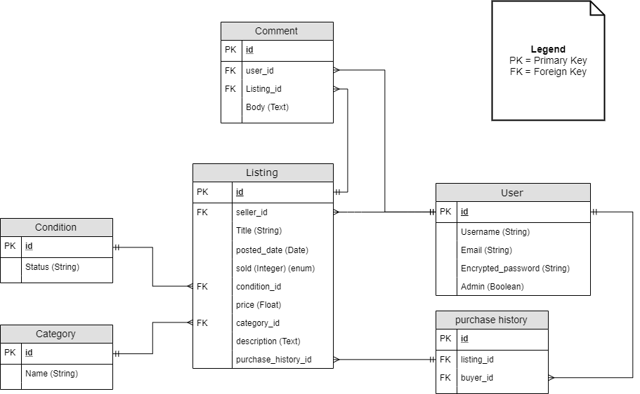

# AccioCurios

## Introduction

AccioCurios is a marketplace for buying and selling collectibles. In today's age, many people collect unique and interesting objects, such as toys or stamps, etc. The goal of AccioCurios is allow buyers and sellers to sell those objects to other users.

Currently, there are big marketplaces, including Ebay, Amazon or Gumtree that allows the trading, selling and buying of any products. However, there isn't a specific online marketplace dedicated to collectible items. Additionally, AccioCurios allows users to track all their trading on a personal dashboard that can only be securely accessed by them.

## Links

[AccioCurios Site Link](https://secret-sea-86315.herokuapp.com/)

[Github Link](https://github.com/MomentaiChris26/AccioCurios)

## Sitemap


## High-Level Components (abstractions)

### Active Record
Is a layer in the rails application that allows the creation, retention and use of objects inside a database. 

All users data, listings data is stored into an Postgresql database. The information is stored into the database via forms inside the rails application. It can also be retrieved using simple queries inside the application, such as `Listings.all` that can be used to display data into the view.

### Active Storage
Is the layer of the rails application that's in charge of facilitates the ability for the application to upload files into a cloud storage from the application and can be queried into the application so a user can interact with.

In AccioCurios, Active Storage allows a user to upload a screenshot or picture of the product they wish to sell. This is linked to AWS S3 cloud storage, where it can be retrieved and viewed in the listings pages.

### Devise

Devise was used in this application to handle the creation and maintanance.

Devise is a gem that allows users to create and stores login details as well a level of authorization for user contents. Devise interacts with the Active Record layer, by creating a table inside the database, which stores specific information related to user accounts. It also creates the controllers and views associated user accounts.


### Cancancan
User authorization
- Gives users access to specific functions based on what the role of the user.
- Provides authorisation and stanization for users based on their id.

### Ransack
Search database
Ransack is a ruby gem that allows the implementation of a search functionality into the application. The search functionality comes in the form of a search bar, that qureies the database and returns the results from the database. Ransacks uses SQL commands to query the database.

### Stripe
Payment system

## Model

- Relationships
- Relations
- Normalized data

## User Stories
Buyers and sellers can purchase or sell their collectibles to each other in a safe and secure web application.

Users sign up with a single account, which allows them to be both a buyer and seller on the same account.

When a user signs up, they have access to their own personal dashboard that lists all their recent purchases, unsold and sold listings on a single page.

They can make listings that show up on all listings page displaying their listings and other user's listings.

As a buyer, they can purchase a product from the listing show page, and make a payment through stripe. This purchase shows up in their dashboard. The seller, will see that the listing as been sold in their dashboard along with the buyer's name and email.

As a seller, they can sell their product, and maintain their products through the show page. They are able to edit or delete their own listings.

When the seller creates the listing, they are able to specify the details of their product, including title, upload a picture of the product, and other necessary details to ensure the buyer is fully informed before they make purchase.

There is an admin role, which grants a specific user (such as a manager) the ability to delete or edit another person's listing, however restricts the admin from being able purchase the product. This security feature prevents an admin from abusing their power.

## Development and Planning

### Planning
Trello was used as the planning tool to document and check progress of the application. The process for keeping track of the tasks was putting them into individual cards on trello. Cards are lined up in the backlog based on the importance of the task. They are moved to 'Doing' when they're being worked on and finally moved to 'Done'. once the task is completed.


## Wireframe

Below are the wireframe for the design of the website.

Home Page


Home Page (375x812) (Mobile View)


All listings Page


All Listings Page (375x812) (Mobile View)


Create Listings Page


## Database Models

The interaction in the ERD is based on a simple design where the relationships revolve around the listings.

As demonstrated below, the ERD contains 6 tables, that interact with listings in one way or another.

The primary table 'listings' contains connections to all tables in the ERD.

Firstly, its separates two attributes into its own tables. These are conditions and categories. The relationship between this is that conditions and categories can have many listings. The purpose of this is to allow users to search for specific listings based on those attributes.

Next, table connected to Listings, is the User table. Users can have many listings and a listing will belong to a user. This is set up this way for authorization purposes. It assigns the listing to a user which only the user can modify or delete the listing.

Comments table is attached to listings. A Listing can have many comments. The comments belong to specific listings as the user would have a space to communicate between each other for stuff such as inquiries.

Finally, the purchase history table is designed to store relevant data relating to when a user has completed a purchase. It 

### ERD


### Schema


Extract from Application Schema

````ruby

ActiveRecord::Schema.define(version: 2019_11_02_102034) do

  # These are extensions that must be enabled in order to support this database
  enable_extension "plpgsql"

  create_table "active_storage_attachments", force: :cascade do |t|
    t.string "name", null: false
    t.string "record_type", null: false
    t.bigint "record_id", null: false
    t.bigint "blob_id", null: false
    t.datetime "created_at", null: false
    t.index ["blob_id"], name: "index_active_storage_attachments_on_blob_id"
    t.index ["record_type", "record_id", "name", "blob_id"], name: "index_active_storage_attachments_uniqueness", unique: true
  end

  create_table "active_storage_blobs", force: :cascade do |t|
    t.string "key", null: false
    t.string "filename", null: false
    t.string "content_type"
    t.text "metadata"
    t.bigint "byte_size", null: false
    t.string "checksum", null: false
    t.datetime "created_at", null: false
    t.index ["key"], name: "index_active_storage_blobs_on_key", unique: true
  end

  create_table "categories", force: :cascade do |t|
    t.string "name"
    t.datetime "created_at", null: false
    t.datetime "updated_at", null: false
  end

  create_table "comments", force: :cascade do |t|
    t.text "body"
    t.bigint "user_id"
    t.bigint "listing_id"
    t.datetime "created_at", null: false
    t.datetime "updated_at", null: false
    t.index ["listing_id"], name: "index_comments_on_listing_id"
    t.index ["user_id"], name: "index_comments_on_user_id"
  end

  create_table "conditions", force: :cascade do |t|
    t.string "status"
    t.datetime "created_at", null: false
    t.datetime "updated_at", null: false
  end

  create_table "listings", force: :cascade do |t|
    t.string "title"
    t.date "posted_date"
    t.integer "sold", default: 0
    t.text "description"
    t.bigint "condition_id"
    t.bigint "category_id"
    t.datetime "created_at", null: false
    t.datetime "updated_at", null: false
    t.bigint "user_id"
    t.float "price", default: 0.0, null: false
    t.integer "buyer_id", default: 0, null: false
    t.index ["category_id"], name: "index_listings_on_category_id"
    t.index ["condition_id"], name: "index_listings_on_condition_id"
    t.index ["user_id"], name: "index_listings_on_user_id"
  end

  create_table "purchase_histories", force: :cascade do |t|
    t.bigint "user_id"
    t.bigint "listing_id"
    t.datetime "created_at", null: false
    t.datetime "updated_at", null: false
    t.index ["listing_id"], name: "index_purchase_histories_on_listing_id"
    t.index ["user_id"], name: "index_purchase_histories_on_user_id"
  end

  create_table "users", force: :cascade do |t|
    t.string "email", default: "", null: false
    t.string "encrypted_password", default: "", null: false
    t.string "reset_password_token"
    t.datetime "reset_password_sent_at"
    t.datetime "remember_created_at"
    t.datetime "created_at", null: false
    t.datetime "updated_at", null: false
    t.string "username", default: "", null: false
    t.boolean "admin", default: false
    t.index ["email"], name: "index_users_on_email", unique: true
    t.index ["reset_password_token"], name: "index_users_on_reset_password_token", unique: true
  end

  add_foreign_key "active_storage_attachments", "active_storage_blobs", column: "blob_id"
  add_foreign_key "comments", "listings"
  add_foreign_key "comments", "users"
  add_foreign_key "listings", "categories"
  add_foreign_key "listings", "conditions"
  add_foreign_key "listings", "users"
  add_foreign_key "purchase_histories", "listings"
  add_foreign_key "purchase_histories", "users"
end
````

## Third Party Services

### Bootstrap
Bootstrap was used for css styling in the application. This allowed the implementation of styling to the website. The elements are provided from an external CDN provided by [Stack Path]("https://www.stackpath.com/"). The styles are taken from a code extract on [Bootstrap]("https://getbootstrap.com/") and modified to fit the pages styling requirement.
