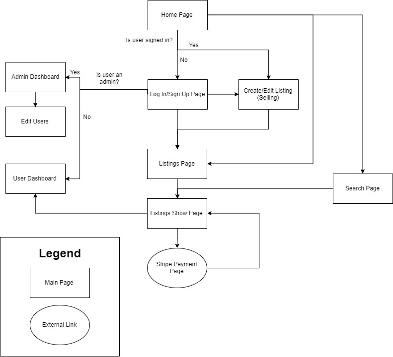
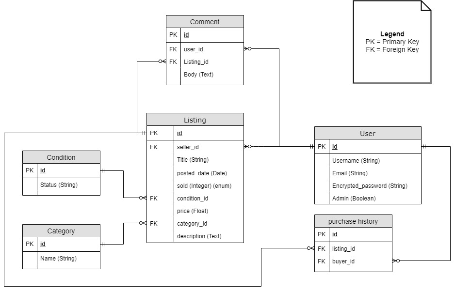
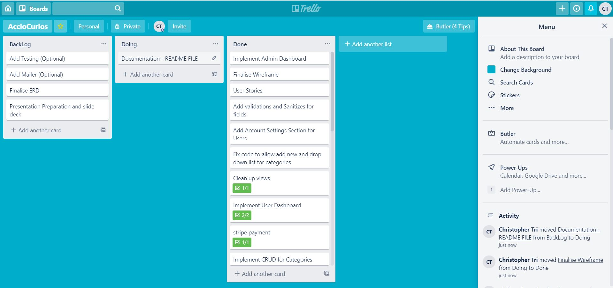

# AccioCurios

## Introduction

AccioCurios is a marketplace for buying and selling collectibles. In today's age, many people collect unique and interesting objects, such as toys or stamps, etc. The goal of AccioCurios is allow buyers and sellers to sell those objects to other users.

## Links

[AccioCurios Site Link](https://secret-sea-86315.herokuapp.com/)

[Github Link](https://github.com/MomentaiChris26/AccioCurios)

## Sitemap


## 1.2 High-Level Components (abstractions)

### Active Record
Is a layer in the rails application that allows the creation, retention and use of objects inside a database. 

All users data, listings data is stored into an Postgresql database. The information is stored into the database via forms inside the rails application. It can also be retrieved using simple queries inside the application, such as `Listings.all` that can be used to display data into the view.

### Active Storage
Is the layer of the rails application that's in charge of facilitates the ability for the application to upload files into a cloud storage from the application and can be queried into the application so a user can interact with.

In AccioCurios, Active Storage allows a user to upload a screenshot or picture of the product they wish to sell. This is linked to AWS S3 cloud storage, where it can be retrieved and viewed in the listings pages.

### Devise
Devise is a gem that provides the creation and maintenance of user accounts on the rails application. It interacts with Active Records to store information into the database when a user signs up. It generates the view pages and controllers required for a user to create their accounts and modify when required. Devise is required in the application to give the ability for users to create, modify or delete their own listings, safely purchase listings and show their purchases and listings on their dashboard.

### Cancancan
Cancancan is a library that provides authorisation and sets permissions in the application. It achieves this by setting defined methods in its own model which can be called to other components of the application. These methods check against the User's role, which would be defined in the database against the user's table and grants permission based on that role. It prevents other users from being able to modify or delete other user's listings.

Permissions are set inside the models/ability.rb, which is generated by Cancancan. There are three levels of permissions set inside this model.

First level is when a user is not signed up or signed in. They're able to read and view the current listings made by other users, but they must be signed in to access additional functionality.

Next level of permission is when a user is signed in. They're able to create, modify or delete their own listings, or buy other user's listings. However, they're unable to modify, or delete other user's listings.

Highest level of permission is an admin role. They're able to modify or delete users, all listings, and data in tables including categories and conditions.

### Ransack
Ransack is a rails library that allows the application to have search features. It does this by querying the database using parameters relevant the listing. In regards to this application, it looks up the title of listing and uses a 'where' clause query on the database with the input from the user.

Ransack is used because it provides the ability for a user to search the title of a listing and return the results to make it easier for users to look for specific listings in the database if they're looking for something specific.

## 1.3 Third Party Services

### Bootstrap
Bootstrap was used for css styling in the application. This allowed the implementation of styling to the website. The elements are provided from an external CDN provided by [Stack Path]("https://www.stackpath.com/"). The styles are taken from a code extract on [Bootstrap]("https://getbootstrap.com/") and modified to fit the pages styling requirement.

### Stripe
Stripe is a payment platform that allows users to purchase other user's listings. It links the user to an external page using the stripe API, where the user can enter their credit card details to complete the purchase. It's designed to allow safe transaction between buyer and seller with maximum security when processing a buyer's payment.

For stripe to pick up the correct data, it queries the database based on the listing information provided in the show page. These parameters are taken into consideration in a method that stripe utilises to return the correct details of the listing to the payment page. 

The reason for using Stripe over a custom payment implementation into the application is due to PCI compliance. In order for application to process payments, it needs to meet a set of requirement set out by PCI security standards. To overcome this issue, the implementation of Stripe, an external payment platform that is already PCI compliance, and eliminates the necessary work to become PCI compliant if we decided to implement a custom payment processing system.

## 3.1 Identify the problem you’re trying to solve
AccioCurios seeks to solve the problem of having a dedicated marketplace for people to buy or sell various collectibles.

In today's market, there are plenty of big market places where people can buy, trade or sell collectibles, such as Ebay, Amazon, or Gumtree. However, these are large marketplaces that contain not only collectibles, but new items, or different type of products that aren't necessarily collectibles.

A collector may only be seeking specific collectibles and may find too many products that may or not be related to what they're looking for. AccioCurios solves this issue by providing the collectors a dedicated marketplace where they can sell and buy their collections.

It focuses on quality or rarity of the product over quantity. As it only allows a user buy a particular product from its marketplace. AccioCurios target audience would be individuals rather than businesses seeking to sell their products. Additionally, it offers a dashboard for users to check their listings and purchases they've made, making it cleaner and easier to keep track of their items.

## 3.3 Model Relationships

Users has many listings
Condition has many listings
Category has many listings
Listing has many comments
Listings has many purchase_history
Users has many purchase_history


### 4.2 ERD Design and interaction


The interaction in the ERD is based on a simple design where the relationships revolve around the listings.

As demonstrated below, the ERD contains 6 tables, that interact with listings in one way or another.

The primary table 'listings' contains connections to all tables in the ERD.

Firstly, its separates two attributes into its own tables. These are conditions and categories. The relationship between this is that conditions and categories can have many listings. The purpose of this is to allow users to search for specific listings based on those attributes.

Next, table connected to Listings, is the User table. Users can have many listings and a listing will belong to a user. This is set up this way for authorization purposes. It assigns the listing to a user which only the user can modify or delete the listing.

Comments table is attached to listings. A Listing can have many comments. The comments belong to specific listings as the user would have a space to communicate between each other for stuff such as inquiries.

Finally, the purchase history table is designed to store relevant data relating to when a user has completed a purchase. 

### 4.3 Schema

Extract from Application Schema

````ruby

ActiveRecord::Schema.define(version: 2019_11_07_051215) do

  # These are extensions that must be enabled in order to support this database
  enable_extension "plpgsql"

  create_table "active_storage_attachments", force: :cascade do |t|
    t.string "name", null: false
    t.string "record_type", null: false
    t.bigint "record_id", null: false
    t.bigint "blob_id", null: false
    t.datetime "created_at", null: false
    t.index ["blob_id"], name: "index_active_storage_attachments_on_blob_id"
    t.index ["record_type", "record_id", "name", "blob_id"], name: "index_active_storage_attachments_uniqueness", unique: true
  end

  create_table "active_storage_blobs", force: :cascade do |t|
    t.string "key", null: false
    t.string "filename", null: false
    t.string "content_type"
    t.text "metadata"
    t.bigint "byte_size", null: false
    t.string "checksum", null: false
    t.datetime "created_at", null: false
    t.index ["key"], name: "index_active_storage_blobs_on_key", unique: true
  end

  create_table "categories", force: :cascade do |t|
    t.string "name"
    t.datetime "created_at", null: false
    t.datetime "updated_at", null: false
  end

  create_table "comments", force: :cascade do |t|
    t.text "body"
    t.bigint "user_id"
    t.bigint "listing_id"
    t.datetime "created_at", null: false
    t.datetime "updated_at", null: false
    t.index ["listing_id"], name: "index_comments_on_listing_id"
    t.index ["user_id"], name: "index_comments_on_user_id"
  end

  create_table "conditions", force: :cascade do |t|
    t.string "status"
    t.datetime "created_at", null: false
    t.datetime "updated_at", null: false
  end

  create_table "listings", force: :cascade do |t|
    t.string "title"
    t.date "posted_date"
    t.integer "sold", default: 0
    t.text "description"
    t.bigint "condition_id"
    t.bigint "category_id"
    t.datetime "created_at", null: false
    t.datetime "updated_at", null: false
    t.bigint "user_id"
    t.float "price", default: 0.0, null: false
    t.integer "buyer_id", default: 0, null: false
    t.index ["category_id"], name: "index_listings_on_category_id"
    t.index ["condition_id"], name: "index_listings_on_condition_id"
    t.index ["user_id"], name: "index_listings_on_user_id"
  end

  create_table "purchase_histories", force: :cascade do |t|
    t.bigint "user_id"
    t.bigint "listing_id"
    t.datetime "created_at", null: false
    t.datetime "updated_at", null: false
    t.index ["listing_id"], name: "index_purchase_histories_on_listing_id"
    t.index ["user_id"], name: "index_purchase_histories_on_user_id"
  end

  create_table "users", force: :cascade do |t|
    t.string "email", default: "", null: false
    t.string "encrypted_password", default: "", null: false
    t.string "reset_password_token"
    t.datetime "reset_password_sent_at"
    t.datetime "remember_created_at"
    t.datetime "created_at", null: false
    t.datetime "updated_at", null: false
    t.string "username", default: "", null: false
    t.boolean "admin", default: false
    t.datetime "deleted_at"
    t.index ["email"], name: "index_users_on_email", unique: true
    t.index ["reset_password_token"], name: "index_users_on_reset_password_token", unique: true
  end

  add_foreign_key "active_storage_attachments", "active_storage_blobs", column: "blob_id"
  add_foreign_key "comments", "listings"
  add_foreign_key "comments", "users"
  add_foreign_key "listings", "categories"
  add_foreign_key "listings", "conditions"
  add_foreign_key "listings", "users"
  add_foreign_key "purchase_histories", "listings"
  add_foreign_key "purchase_histories", "users"
end

````

## 6.1 User Stories
Buyers and sellers can purchase or sell their collectibles to each other in a safe and secure web application.

Users sign up with a single account, which allows them to be both a buyer and seller on the same account.

When a user signs up, they have access to their own personal dashboard that lists all their recent purchases, unsold and sold listings on a single page.

They can make listings that show up on all listings page displaying their listings and other user's listings.

As a buyer, they can purchase a product from the listing show page, and make a payment through stripe. This purchase shows up in their dashboard. The seller, will see that the listing as been sold in their dashboard along with the buyer's name and email.

As a seller, they can sell their product, and maintain their products through the show page. They are able to edit or delete their own listings.

When the seller creates the listing, they are able to specify the details of their product, including title, upload a picture of the product, and other necessary details to ensure the buyer is fully informed before they make purchase.

There is an admin role, which grants a specific user (such as a manager) the ability to delete or edit another person's listing, however restricts the admin from being able purchase the product. This security feature prevents an admin from abusing their power.

## 6.2 Wireframe

Below are the wireframe for the design of the website.

Home Page


Home Page (375x812) (Mobile View)


All listings Page


All Listings Page (375x812) (Mobile View)


Create Listings Page


## 6.3 Planning
Trello was used as the planning tool to document and check progress of the application. The process for keeping track of the tasks was putting them into individual cards on trello. Cards are lined up in the backlog based on the importance of the task. They are moved to 'Doing' when they're being worked on and finally moved to 'Done'. once the task is completed.





